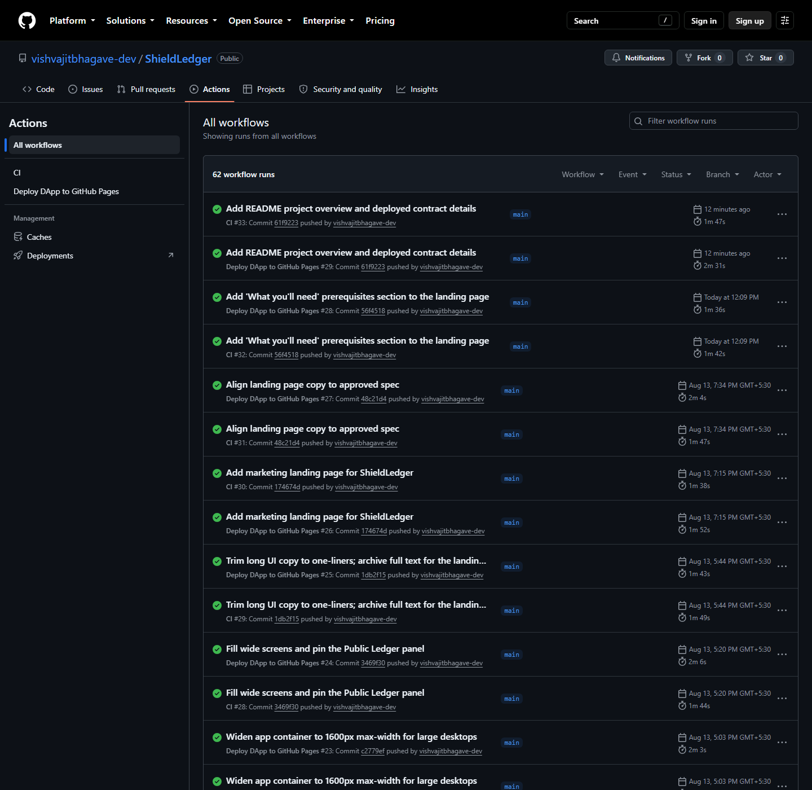
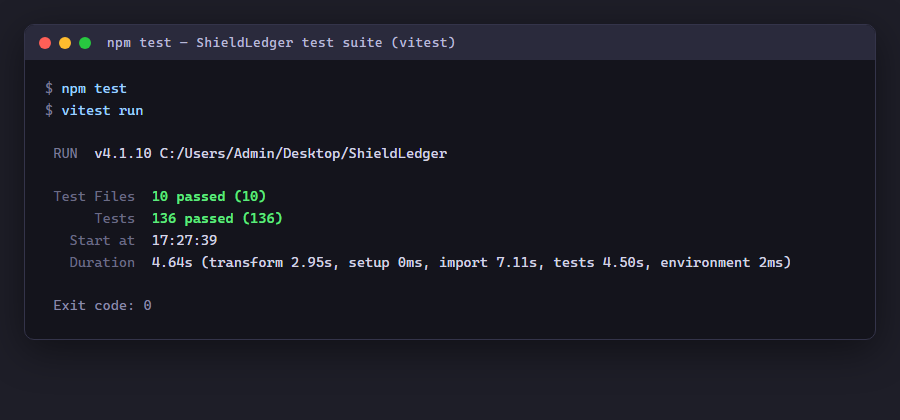

# ShieldLedger

[](https://github.com/vishvajitbhagave-dev/ShieldLedger/actions/workflows/ci.yml)

> Confidential invoice financing on Midnight — invoices registered privately, bids sealed, settlements proven in zero knowledge.

## Live Demo

[Preprod demo URL](https://vishvajitbhagave-dev.github.io/ShieldLedger/)

**Demo video** — wallet connect + a successful circuit call on the Preview testnet:

https://drive.google.com/file/d/1Jo0o03gjT0YcqAVUUIzWBfvHHYL2rDv0/view?usp=drive_link

**Link to the product X profile-**

https://x.com/ShieldLedger

## Contract Address

| Network | Address |
|---------|---------|
| Preview | `18737084144f6482d529fdb8fa357966c9c2eb2c3734d1753f4b42648a4dc4a6` |
| Preprod | `a503d5c086f8ab42f3a650fa0c4b67e31ac37c7eb997c8513c3dccf38de8c925` |

View on block explorers:
- [1AM Explorer — Preview contract](https://explorer.1am.xyz/contract/18737084144f6482d529fdb8fa357966c9c2eb2c3734d1753f4b42648a4dc4a6?network=preview)
- [1AM Explorer — Preprod contract](https://explorer.1am.xyz/contract/a503d5c086f8ab42f3a650fa0c4b67e31ac37c7eb997c8513c3dccf38de8c925?network=preprod)

## What This Product Does

ShieldLedger is a confidential invoice-financing marketplace built on the [Midnight Network](https://docs.midnight.network). Small and medium enterprises (SMEs) register trade invoices on-chain without revealing their contents — invoice details, financial history, and identity never leave the wallet. Lenders compete in a **sealed-bid private auction** under pseudonyms: bids are commitments, no lender sees another's bid, and the **lowest interest rate wins**, enforced by the contract.

Corporate buyers confirm invoices in zero knowledge — proving the invoice is genuine and the amount matches — without disclosing their identity or supply chain. A **cross-deal reputation score** (0–100, +10 on-time, −20 late) accrues privately across settlements and is proven in ZK at each registration, so reliable SMEs get cheaper capital without ever publishing a financial dossier. An **automated default insurance pool** (2% premiums in, 50% proven-default payouts out) provides mutual protection while keeping the defaulting SME's identity hidden.

Only opaque nullifiers, commitments, pseudonyms, and disclosed terms ever touch the public ledger. Privacy is enforced by zero-knowledge circuits, not policy.

## Privacy Model

**What is PUBLIC (on-chain, anyone can see):**
Invoice nullifiers, SME commitments, credit/reputation attestation bounds ("score ≥ N"), lender pseudonyms, sealed-bid commitments, winning bid terms after reveal, settlement receipt, buyer-verified flag + buyer commitment, insurance pool balance, paid insurance claims (keyed by nullifier), **per-lender pool settlement payout amounts** (required by Compact 0.23 ledger-write disclosure rule — see [docs/compact-privacy-notes.md](docs/compact-privacy-notes.md)), **payout commitment hashes** (binding for insurance claims).

**What is PRIVATE (private witness, never on-chain):**
Invoice contents, SME secret, credit score (exact value), reputation score + on-time/late counts, lender secret, lender credit score, lender's minimum-reputation bar, lender exposure cap, bid terms before reveal, buyer secret, settlement on-time/late classification. **Per-lender pool contribution amounts are NOT directly disclosed or written to the ledger** (constrained only by sum proof and proportional checks), **but they are mathematically derivable** from the public `invoiceAmount`, per-lender payouts, and `totalPayout` via the proportional relationship — see [Known limitations](#known-limitations). True per-lender contribution secrecy is **not** achieved.

**What the user PROVES without revealing:**
Credit score ≥ threshold, reputation score ≥ threshold, lender credit score ≥ 700, buyer knows the invoice is genuine, bid commitment matches revealed terms, SME owns the invoice, default conditions are met (financed, unsettled, past due) for insurance payout, **individual contributions sum to the invoice amount** (zero-knowledge sum proof), **each payout is proportional to its contribution** (zero-knowledge floor proof via `verifyProportionalPayout`).

## Tech Stack

- **Smart contract:** [Compact 0.23](https://docs.midnight.network/developers/language/compact/) (Midnight's ZK contract language)
- **Frontend:** React 19 + Vite + TypeScript
- **Wallet:** [Midnight Lace](https://lace.io/) (browser extension)
- **Runtime:** Midnight.js 4.1.1, proof-server 8.1.0, Compact compiler 0.31.1
- **Testing:** Vitest, headless Compact circuit simulator
- **CI/CD:** GitHub Actions → GitHub Pages

## Prerequisites

- **Node.js ≥ 22** and npm
- **Docker** with `docker compose` (for the local proof-server)
- **Midnight Lace wallet** (browser extension, connected to Preview or Preprod network)
- **[compactc](https://docs.midnight.network/developers/tooling/compactc/)** on PATH (used by `npm run compile`)

## Setup & Run Locally

```bash
# 1. Clone the repository
git clone https://github.com/vishvajitbhagave-dev/ShieldLedger.git
cd ShieldLedger

# 2. Install dependencies
npm install

# 3. Compile the Compact contract
npm run compile

# 4. Start the local proof-server (Docker)
npm run proof-server:start

# 5. Create a wallet, fund it from the faucet, and deploy the contract
npm run setup -- --network preview

# 6. Start the browser DApp
npm run frontend:dev
```

Open the displayed URL in your browser and connect with the Midnight Lace wallet.

## Run Tests

```bash
npm test                 # 192 simulator tests (all circuits + frontend logic)
npm run test:e2e         # read-only smoke check against the deployed contract
npm run build            # TypeScript typecheck (root + frontend)
```

## CI/CD

Two GitHub Actions workflows run on every push to `main`:

1. **CI** (`ci.yml`) — compiles the contract, runs the full test suite, typechecks, and builds the browser DApp.
2. **Deploy DApp to GitHub Pages** (`deploy-pages.yml`) — builds and deploys the DApp to [GitHub Pages](https://vishvajitbhagave-dev.github.io/ShieldLedger/).

Both workflows use the Midnight Compact compiler action (`midnightntwrk/setup-compact-action@v1`) and Node.js 22.

## Usage Guide

See [docs/USAGE.md](docs/USAGE.md) for a step-by-step guide covering all three roles (SME, Buyer, Lender), including invoice registration, buyer verification, sealed-bid auction, settlement, the secondary market, and the default insurance pool.

## Product X Profile

[@ShieldLedger](https://x.com/ShieldLedger)

---

## How It Works

The contract (`contracts/shield-ledger.compact`) is written in Compact. Everything the SME or lender wishes to keep confidential stays in private witness data; only hashes and disclosed terms are published.

| Piece | Public on ledger | Private |
| --- | --- | --- |
| Invoice registration | nullifier (32-byte hash of the invoice), SME commitment (hash of SME secret + nullifier), **credit attestation** ("score ≥ N", the proven bound), **reputation attestation** ("reputation ≥ N", the proven bound) | invoice contents, SME secret, **credit score**, **reputation score** |
| Bidding | bid key (hash of nullifier + pseudonym), lender pseudonym (hash of lender secret), **commitment to the bid terms** | bid terms (amount, due date, interest rate) until reveal, lender secret, credit score, exposure cap, **lender minimum reputation** |
| Reveal | leading bid's terms + lender pseudonym (only if it beats the running best) | — (commitment re-derivation proves ownership) |
| Settlement | winning lender pseudonym, financed amount, financed due date, winning interest rate; **pool settlement: per-lender payout amounts (public inputs), payout commitment hashes (on-chain binding)** | — (SME proves ownership via commitment); the on-time/late classification and the reputation update stay in the SME's wallet; **pool: contributions are not directly disclosed, but are derivable from the public payouts + `invoiceAmount` (see [Known limitations](#known-limitations))** |
| Default insurance | ONE shared pool balance (2% premiums in, 50% default payouts out), paid claims keyed only by the already-public nullifier | which SME funded the pool; why a specific claim was paid; the fact that *this* SME defaulted |

### Sealed-Bid Auction

Because Compact circuits cannot iterate over a `Map`, "lowest rate wins" is built from per-reveal comparisons against a running best:

1. SME calls `registerInvoice` with a credit bound and an optional reputation bound (invoice is now `BIDDING`).
2. Optionally, the corporate buyer calls `confirmInvoice` — the `buyer-verified` flag and an opaque per-invoice commitment become public.
3. Each lender calls `submitBid` with a **commitment** — terms are hidden; the contract also enforces the lender's private minimum-reputation bar against the SME's public reputation bound.
4. Lenders who want to compete call `revealBid` with their true terms. The contract verifies the commitment, then compares against the running best; the best bid (lowest rate → smallest amount → earliest due) takes the lead.
5. SME calls `settleInvoice` — the contract pays the *current* best bid; favoritism is impossible. The circuit classifies the settlement on-time or late.

### Pooled Multi-Investor Financing

Invoices can be financed by a pool of up to 4 lenders instead of a single winner. The SME sets `splitCount > 0` at registration, and multiple lenders each commit to a portion.

1. SME registers with `splitCount` = 2–4 (e.g., `splitCount: 4` means up to 4 lenders can co-finance).
2. Each lender places a sealed pool bid (`submitBid` + `revealPoolBid`) targeting a specific slot index (0–3).
3. The contract fills pool slots in reveal order. All bids in a pool share the same `totalContribution` (= invoice amount) and `totalPayout` (repayment amount). The winning pool is the one with the **lowest weighted average rate** (sum of `rate × contribution` / total).
4. SME calls `settleSplitInvoice` with per-lender contribution and payout arrays. The circuit verifies each payout is proportional to its contribution (floor-exact via `verifyProportionalPayout`) and that all contributions sum to the invoice amount. **Contribution amounts are not directly disclosed on-chain and carry no `disclose()`**; **payout amounts are public inputs** (required by Compact 0.23's ledger-write disclosure rule — see [docs/compact-privacy-notes.md](docs/compact-privacy-notes.md)). Payout commitment hashes are stored on-chain to bind insurance claims to the proved payout values. **Note:** because the public payouts, `invoiceAmount`, and `totalPayout` are linked by the proportional proof, each contribution amount is *mathematically derivable* from on-chain data — true per-lender contribution secrecy is not achieved (see [Known limitations](#known-limitations)).
5. Any floor-rounding remainder (< 4 tNight for a 4-lender pool) is routed to the insurance pool as additional premium — modeled on Uniswap V3 fee-rounding behavior.

### Pool Insurance (Per-Lender Claims)

Each pool lender independently claims their proportional share of the 50% default insurance entitlement based on their contribution ratio:

1. After pool settlement, the invoice's lender field is set to the `"shieldledger:pool"` marker.
2. Each lender proves ownership of their slot via the same two-phase auth pattern (pseudonym for untraded slots, claim commitment for transferred slots).
3. The circuit verifies `insurancePayout ≤ floor(settlementPayout × totalInsurance / invoice.amount)` — the upper bound. When the insurance pool is thin (total entitlement exceeds pool balance), each claimant receives a proportional share of the remaining balance, not a fixed amount.
4. **Thin-pool behavior (intentional design):** When the pool cannot cover all entitlements, each claim is capped by `pool.balance × settlementPayout / invoice.amount`. The first claimant to collect receives a larger absolute amount than later claimants, but the fraction relative to their settlement payout is identical. Once the pool is drained, subsequent claimants receive zero. This is a **shared shortfall** — not first-come-first-served — because every lender's payout is proportionally reduced by the same ratio. The single-use `insuranceClaims[slotKey]` map prevents double-claiming.

### Pool Secondary Market (Per-Lender Transfer)

Each pool lender can independently transfer their claim to a new investor, even after pool settlement:

1. Before settlement: the original lender transfers using their `lenderSecret` (pseudonym-based auth).
2. After pool settlement: the original lender still transfers using `lenderSecret` (the lender field is `"shieldledger:pool"`, not a specific lender). The new holder stores an opaque `claimCommitment`.
3. Later transfers (by the secondary buyer): the current holder proves ownership via their `claimSecret` (commitment-based auth).
4. Insurance claims follow the same two-phase auth pattern, so the current holder collects regardless of how many transfers occurred.

### Key Circuits

- **`registerInvoice`** — proves credit score ≥ threshold and reputation ≥ threshold in ZK; pays 2% insurance premium via `verifyUnitQuotient`; asserts pool balance update. For pooled invoices (`splitCount > 0`), does NOT populate `bestBids`.
- **`confirmInvoice`** — buyer proves invoice is genuine and amount matches; stores opaque buyer commitment.
- **`submitBid`** — lender proves credit score ≥ 700; stores only a commitment to bid terms.
- **`revealBid`** — re-derives commitment; enforces private exposure cap; updates running best (single-lender auction only).
- **`revealPoolBid`** — fills a slot in the pool map for `splitCount > 0` invoices; independently tracks pool bids.
- **`settleInvoice`** — pays the winning bidder; proves on-time/late classification (returned to wallet only).
- **`settleSplitInvoice`** — pays per-lender proportional payouts; verifies floor-exact proportional proof; routes floor-rounding remainder to insurance pool; sets lender to `"shieldledger:pool"`.
- **`claimInsurancePayout`** — proves default conditions (past due, unsettled); pays 50% of financed amount from shared pool (partially if thin); prevents double-claim.
- **`claimPoolInsurancePayout`** — per-lender pool insurance claim; proves `insurancePayout ≤ floor(settlementPayout × totalInsurance / invoice.amount)`; thin-pool shared-shortfall behavior; single-use per slot.
- **`transferPoolClaim`** — per-lender claim transfer (two-phase auth: pseudonym before settlement, commitment after); allowed both before and after pool settlement.
- **`verifyProportionalPayout`** — division-free floor-exact proportional proof (Compact has no division operator).
- **`verifyUnitQuotient`** — division-free percentage proof powering both 2% premium and 50% payout.

### Default Insurance Pool

Every registration pays 2% of the invoice face amount (floored) into one shared public pool. A proven default (financed, unsettled, past due) lets the current claim holder collect 50% of the financed amount — partially if the pool is thin. Both percentages are proven in-circuit via `verifyUnitQuotient` (Compact has no division operator). The defaulting SME's identity is never revealed.

**Thin-pool behavior (both single-lender and pool invoices):** When the pool balance cannot cover the full entitlement, the payout is capped at the pool's remaining balance. For single-lender invoices, the claimant drains the pool entirely. For pool invoices, each lender receives a proportional share of the remaining balance based on their contribution ratio — the shortfall is shared equally across all slots. This is modeled on Uniswap V3 fee-rounding: the pool balance is a shared resource, not a queue.

### Secondary Market

After auction resolution, the winning lender can resell their claim (`transferClaim`). Authorization mirrors settlement exactly: the auction-leader pseudonym before any transfer, an opaque commitment after. On-chain this is just a new commitment and a `transferred` flag — the investor's identity never appears.

For pool invoices, each lender independently transfers their slot's claim via `transferPoolClaim`. The two-phase auth pattern (pseudonym → commitment) supports unlimited secondary transfers per slot.

### Cross-Deal Reputation

Every settlement updates a private reputation in the wallet (+10 on-time, −20 late, clamped 0–100). At registration the SME proves "my reputation ≥ N" in ZK. At bidding, the lender's private minimum-reputation bar is compared against the stored bound inside the circuit. Neither value is disclosed.

### Multi-Contract Design

A separate escrow contract (`contracts/escrow.compact`) holds financing per invoice. Ownership crosses the boundary via a shared commitment — the same `hash(smeSecret, nullifier)` stored on both chains, so only the wallet that can settle an invoice can release its escrow. The contracts are coordinated off-chain via `frontend/src/escrow-orchestrator.ts`.

## Repository Layout

```
contracts/shield-ledger.compact   Auction contract source (the source of truth)
contracts/escrow.compact          Escrow contract source
contracts/managed/                Compiler output — generated by `npm run compile` (gitignored)
docs/
  architecture.md                 Architecture + requirements checklist
  USAGE.md                        Step-by-step usage guide for all roles
  production.md                   Deployment runbook
  monitoring.md                   Monitoring & analytics
  review.md                       Production-readiness assessment
src/
  compile.ts                      Compiles all Compact contracts
  insurance.ts                    Shared insurance formulas (premium, payout, pool key)
  setup.ts                        Creates/funds wallet, deploys contract
  cli.ts                          Interactive CLI (12 menu options)
  reputation.ts                   Shared reputation formula (+10/−20, 0–100)
  witnesses.ts                    Witness definitions feeding the circuits
frontend/
  src/components/                 React components (WalletConnect, LedgerView, InvoiceFinancing, etc.)
  src/hooks/                      Custom hooks (use-ledger-state)
  src/shield-ledger-api.ts        Contract interaction layer
tests/                            Vitest simulator tests (192 tests across 14 suites)
scripts/
  e2e-check.ts                    On-chain smoke check
  demo-reputation-cycle.ts        Demo-only reputation tool
.github/workflows/
  ci.yml                          CI pipeline (compile + test + typecheck + build)
  deploy-pages.yml                GitHub Pages deployment
```

## Mainnet/Testnet

ShieldLedger is a **working demonstration on the Midnight Preview and Preprod testnets** — not a regulated financial service.

| Environment | Status | Details |
| --- | --- | --- |
| Midnight **Preview** (testnet) | **Active** | Live contract + DApp; funded with free test tokens from the [Preview faucet](https://faucet.preview.midnight.network/). |
| Midnight **Preprod** (testnet) | **Active** | Live contract (no DApp build); funded with free test tokens from the [Preprod faucet](https://midnight-tmnight-preprod.nethermind.dev/). |
| Midnight **Mainnet** | Not deployed | Requires Midnight mainnet tooling; nothing has been deployed there. |

## End-to-End Verification (Preview)

| Flow | TxID | Block |
| --- | --- | --- |
| `registerInvoice` | `0094eb20df7e2664a60bf2a954936d188bc3a6690fa9d2fb3306a4b75ced0ddad0` | 348161 |
| `submitBid` | `00b5ea191391f078eba680333bfb1eac7b2846d1b52afdcd87ed6f5169bbe20f16` | 348212 |
| `settleInvoice` | `001aeab17880b96e64d4ea4441d84b82ec528173171d615c18dcee3296153e70bf` | 348243 |

## Demonstration

**Desktop UI**


**Mobile responsive UI**


**CI/CD pipeline**



**Test output**



**Demo video** — wallet connect + a successful circuit call on the Preview testnet:

https://drive.google.com/file/d/1Jo0o03gjT0YcqAVUUIzWBfvHHYL2rDv0/view?usp=drive_link

## Known Limitations

- **Payout visibility (accepted, Compact-enforced).** On pooled pool-financed invoices, per-lender payout amounts are public. Compact 0.23's ledger-write disclosure rule requires any value flowing into a ledger write (including `persistentHash`) to be `disclose()`d, so `payout_i` and `totalPayout` are public inputs and the commitment hashes provide binding but not privacy. See [docs/compact-privacy-notes.md](docs/compact-privacy-notes.md).
- **Contribution amounts are derivable, not secret (known gap for future work).** Although individual contribution amounts are never directly disclosed or written to the ledger, they are **mathematically derivable** from public on-chain data. Because the proportional proof links each public payout to `totalContribution`, and the sum proof links the contributions to the public `invoiceAmount` (with `totalContribution == invoiceAmount` used in practice), an observer can recover `contribution_i == invoiceAmount * payout_i / totalPayout`. True per-lender contribution secrecy is therefore **not** achieved by the current design — only aggregate/pool-level privacy is. Closing this would require hiding or unlinking the public anchors used here (e.g. not publishing `totalPayout`/per-lender payouts in a form tied to `invoiceAmount`, or proving proportionality against a hidden total).

## Future Work

- **On-chain circuit breaker (Part B).** The current market health monitoring (Part A) is purely off-chain: the Dashboard computes a health status from public ledger data and displays a warning/critical banner when anomalous conditions are detected. An on-chain circuit breaker that automatically pauses new bids and registrations when a threshold is breached was scoped out for this pass. The contract currently has no access-control or admin/governance pattern — every circuit is authorized purely through cryptographic proofs (knowledge of a secret, credit score thresholds, claim-holder re-derivation). Introducing a privileged pause authority is a deliberate governance design decision that requires careful thought about who holds the key, how it is rotated, and what accountability exists. This is reserved for future work when the governance model is agreed upon.
- **Historical trend tracking.** Current monitoring evaluates the latest snapshot of ledger state. Adding on-chain timestamps to registration events (not currently stored) would enable time-windowed velocity detection (claims per hour, payout rate trends).
## License

MIT.
