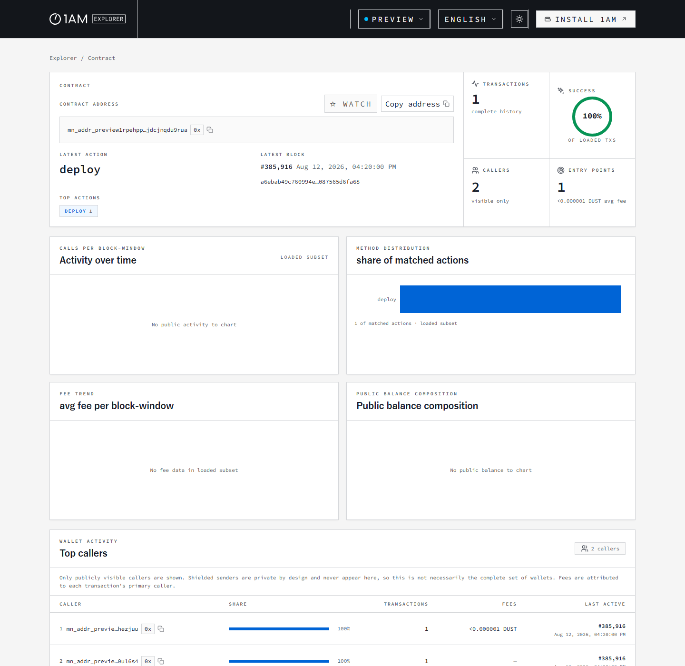
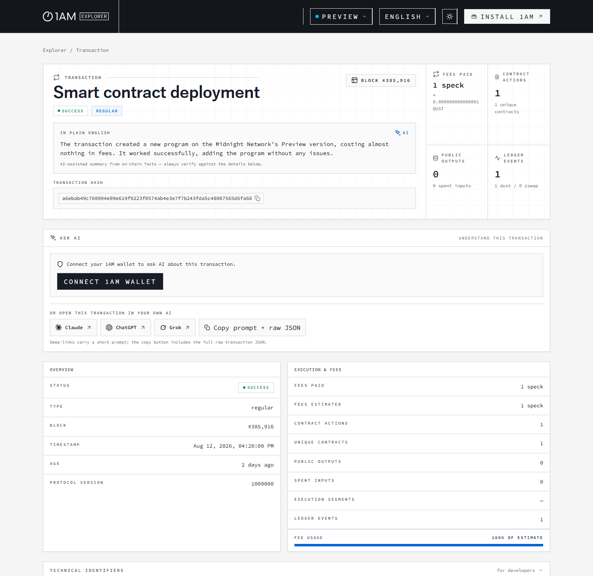
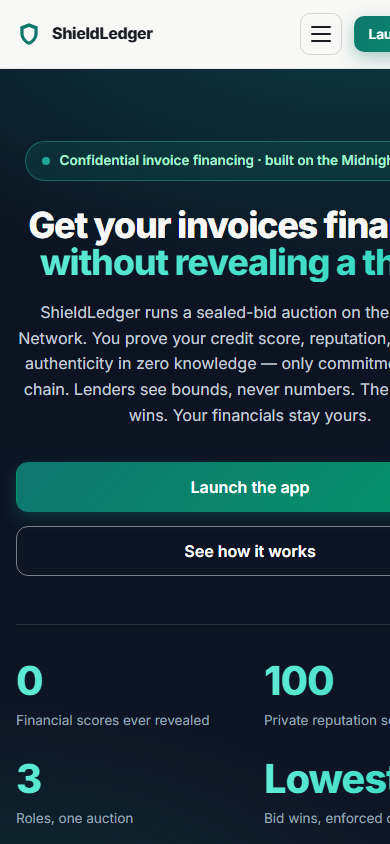
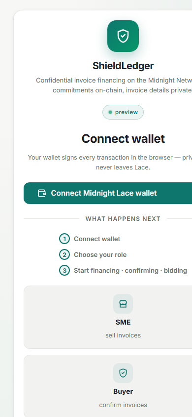

# ShieldLedger

[](https://github.com/vishvajitbhagave-dev/ShieldLedger/actions/workflows/ci.yml)

## Live demo

- **Web app** — https://vishvajitbhagave-dev.github.io/ShieldLedger/ (connect with the Midnight Lace wallet on the Preview network)
- **Landing page** — https://vishvajitbhagave-dev.github.io/ShieldLedger/landing.html

## Project Description

Confidential invoice-financing marketplace on the [Midnight Network](https://docs.midnight.network). SMEs register invoices without revealing their contents; lenders compete in a **sealed-bid private auction** under pseudonyms — bids are commitments, only the winner's terms are ever revealed — and the **lowest interest rate wins**, enforced by the contract. Settlement is proven in zero knowledge. Only opaque nullifiers, commitments, pseudonyms, and the winning terms ever touch the public ledger.

## Project Vision

ShieldLedger's vision is a financing market where creditworthiness is a **provable property, not a dossier**. An SME should be able to get its invoices financed on the best available terms without publishing financial history; a lender should be able to underwrite with confidence while seeing only proven bounds; and a buyer should be able to vouch for an invoice without exposing its commercial relationships. This is only achievable on a chain where zero knowledge is the default, so we treat the ZK circuits as the trust boundary and keep every sensitive value inside the wallet.

## Key Features

- **Confidential invoice financing** — SMEs register invoices on-chain as opaque nullifiers; invoice contents, terms, and secrets never leave the browser.
- **ZK credit scoring** — registration proves *"my credit score is ≥ N"* inside the circuit (contract floor 650); lenders see the bound, never the score.
- **Private cross-deal reputation** — a 0–100 wallet-side score (+10 on-time, −20 late) that accrues across deals and is proven, never shown.
- **Buyer verification** — buyers confirm invoices in zero knowledge; only a **Buyer-verified ✓** flag and an opaque commitment become public.
- **Sealed-bid private auction** — lenders post only commitments to their terms; no lender sees another's bid. The **lowest rate wins**, enforced by the contract.
- **Settlement fairness** — the contract pays the running-best bid automatically; the SME cannot play favorites. On-time/late classification drives reputation.
- **Browser DApp** — a React/Vite app that connects through the Midnight Lace wallet with dedicated SME, Buyer, and Lender workflows.
- **Multi-contract design** — a separate escrow contract holds financing per invoice, coordinated off-chain via a shared commitment.

## Mainnet/Testnet

ShieldLedger is a **working demonstration on the Midnight Preview and Preprod testnets** — not a regulated financial service.

| Environment | Status | Details |
| --- | --- | --- |
| Midnight **Preview** (testnet) | **Active** | Live contract + DApp; funded with free test tokens (tNight/tDUST) from the [Midnight Preview faucet](https://faucet.preview.midnight.network/). |
| Midnight **Preprod** (testnet) | **Active** | Live contract (no DApp build); funded with free test tokens (tNight/tDUST) from the [Midnight Preprod faucet](https://midnight-tmnight-preprod.nethermind.dev/). |
| Midnight **Mainnet** | Not deployed | Requires Midnight mainnet tooling/requirements; nothing has been deployed there. |

## Contract Details

The current recorded Preview deployment of the auction contract:

| | |
| --- | --- |
| **Contract ID** | `18737084144f6482d529fdb8fa357966c9c2eb2c3734d1753f4b42648a4dc4a6` |
| **Deployer** | `mn_addr_preview1t3te36lz6uwlvgu5tnlq9h3w7c5upgcvgvcyexns8638w3jme5uqnepcmz` |
| **Deployed** | 2026-08-12 |
| **Network** | Preview |

Latest on-chain activity (from the Preview indexer): the contract state was last updated by transaction `a6ebab49c760994e09e619f9223f0574ab4e3e7f7b243fda5c48087565d6fa68` in block `385916`.

View the deployed contract in a block explorer:

- [1AM Explorer — contract](https://explorer.1am.xyz/contract/18737084144f6482d529fdb8fa357966c9c2eb2c3734d1753f4b42648a4dc4a6?network=preview)
- [1AM Explorer — latest contract transaction](https://explorer.1am.xyz/tx/a6ebab49c760994e09e619f9223f0574ab4e3e7f7b243fda5c48087565d6fa68?network=preview)
- [Midnight Explorer (Preview)](https://preview.midnightexplorer.com/) — search the contract ID above





The current recorded Preprod deployment of the auction contract:

| | |
| --- | --- |
| **Contract ID** | `a503d5c086f8ab42f3a650fa0c4b67e31ac37c7eb997c8513c3dccf38de8c925` |
| **Deployer** | `mn_addr_preprod1ny7a55efaxjhx98ha5p658d0evxlkaeksvyd7uj5m530ypylyrzs0u7wst` |
| **Deployed** | 2026-08-16 |
| **Network** | Preprod |

Verified on-chain via `npm run test:e2e -- --network preprod` (reconnects to the contract and reads its ledger state through the Preprod indexer). View it in a block explorer:

- [1AM Explorer — contract (Preprod)](https://explorer.1am.xyz/contract/a503d5c086f8ab42f3a650fa0c4b67e31ac37c7eb997c8513c3dccf38de8c925?network=preprod)
- [Midnight Explorer (Preprod)](https://preprod.midnightexplorer.com/) — search the contract ID above

> The DApp deploys a fresh contract each time you Connect → Deploy, so this is the currently recorded deployment. An earlier pre-credit-scoring deployment (`25d5118f…0689`) is preserved for reference in the setup section below.

## How it works

The contract (`contracts/shield-ledger.compact`) is written in Compact. Everything the SME or lender wishes to keep confidential stays in private witness data; only hashes and disclosed terms are published.

| Piece | Public on ledger | Private |
| --- | --- | --- |
| Invoice registration | nullifier (32-byte hash of the invoice), SME commitment (hash of SME secret + nullifier), **credit attestation** ("score ≥ N", the proven bound), **reputation attestation** ("reputation ≥ N", the proven bound) | invoice contents, SME secret, **credit score**, **reputation score** |
| Bidding | bid key (hash of nullifier + pseudonym), lender pseudonym (hash of lender secret), **commitment to the bid terms** | bid terms (amount, due date, interest rate) until reveal, lender secret, credit score, exposure cap, **lender minimum reputation** |
| Reveal | leading bid's terms + lender pseudonym (only if it beats the running best) | — (commitment re-derivation proves ownership) |
| Settlement | winning lender pseudonym, financed amount, financed due date, winning interest rate | — (SME proves ownership via commitment); the on-time/late classification and the reputation update stay in the SME's wallet |

Key ledger maps and circuits:

- `registerInvoice(nullifier, creditThreshold, invoiceAmount, reputationThreshold)` — asserts the invoice is not already registered, proves the SME's **credit score ≥ creditThreshold** *and* **reputation score ≥ reputationThreshold** in zero knowledge (neither score ever leaves the wallet; only the chosen bounds are stored), discloses `deriveCommitment(smeSecret, nullifier)`, and inserts an empty `Invoice`. Thresholds below the contract's credit floor (650) are rejected, so "credit-checked" can't be gamed into a score ≥ 0 claim. The claimed face amount (`invoiceAmount`) is posted publicly so the buyer can later vouch for it; `reputationThreshold = 0` means "no reputation requirement".
- `confirmInvoice(nullifier, confirmedAmount)` — the corporate buyer proves in zero knowledge that the invoice is genuine and that it owes exactly `invoiceAmount`: the circuit asserts the invoice exists, is not already financed, is not already verified, and that `confirmedAmount == invoiceAmount` (a mismatch fails the proof). It stores an opaque per-invoice commitment `deriveBuyerCommitment(buyerSecret, nullifier)` and flips the public `buyerVerified` flag. Only the boolean flag and that commitment go on-chain — the buyer's identity, other supplier relationships and terms never do, and the commitment binds the confirmation to this specific invoice (no replay, no forging across invoices).
- `submitBid(nullifier, commitment)` — asserts `lenderCreditScore >= 700` *without disclosing it*, asserts the SME's **stored reputationThreshold ≤ the lender's private minimum** `lenderMinReputation()` *without disclosing either value*, derives the lender's pseudonym and bid key, and stores a `SealedBid` holding only the commitment (`deriveBidCommitment(lenderSecret, nullifier, amount, dueDate, rateBps)`). No other lender can see the terms.
- `revealBid(nullifier, amount, dueDate, rateBps)` — re-derives the commitment from the private lender secret, asserts it matches the stored seal (so only the genuine bidder can reveal), enforces the private exposure cap, and updates the invoice's **running best bid** if the terms beat it (lowest interest rate, then smallest amount, then earliest due date; ties keep the earlier revealer).
- `settleInvoice(nullifier, financedAmount, financedDueDate, settledAt)` — asserts SME ownership, requires a resolved auction, pays the *running best* bid, and **returns** `disclose(settledAt) <= disclose(financedDueDate)` (on-time vs late). The SME cannot choose a losing lender; the returned boolean is the wallet-layer's reputation input (see below).
- `deriveCommitment`, `derivePseudonym`, `deriveBidKey`, `deriveBidCommitment`, `deriveBuyerCommitment` — `persistentHash` helpers; `isBetter` is the deterministic comparison used at reveal.

Bids live in a single-level `Map<Bytes<32>, SealedBid>` keyed by `deriveBidKey(nullifier, pseudonym)` because the runtime rejects member/lookup on absent nested-map keys; a flat map keeps every lookup guarded by a member check. The same flat-map style applies to the per-invoice running best (`Map<Bytes<32>, BestBid>`).

## The sealed-bid auction

Because Compact circuits cannot iterate over a `Map`, "lowest rate wins" is built from **per-reveal comparisons against a running best**, not a final fold over all bids:

1. SME calls `registerInvoice` with a credit bound and an optional reputation bound (invoice is now `BIDDING`).
2. *Optionally*, the corporate buyer calls `confirmInvoice` with the claimed amount — the `buyer-verified` flag and an opaque per-invoice commitment become public, so lenders can see the invoice is genuine without learning anything else about the buyer.
3. Each lender calls `submitBid` with a **commitment** — amount, due date and rate are hidden, so lenders cannot shade their bids against each other. The contract also enforces the lender's private minimum-reputation bar against the SME's public reputation bound.
4. Lenders who want to compete call `revealBid` with their true terms. The contract verifies the commitment, then compares against the running best; the best bid (lowest rate → smallest amount → earliest due) takes the lead. The leader is only ever updated by a genuine bidder.
5. SME calls `settleInvoice` — the contract pays the *current* best bid; favoritism is impossible. The circuit classifies the settlement on-time or late, and the SME's wallet applies the reputation update (see below).

Privacy trade-off (inherent to a public ledger): bids stay hidden through the whole bidding phase, and a losing bid is only exposed if its owner reveals it; the winning bid's terms are public because the financing receipt is public.

## Repository layout

```
contracts/shield-ledger.compact   Auction contract source (the source of truth)
contracts/escrow.compact          Escrow contract source — funds per invoice until settlement
contracts/managed/                Compiler output — generated by `npm run compile` (gitignored)
docs/
  architecture.md              Architecture + requirements checklist + demo script
  production.md                Deployment runbook (release, verify, rollback)
  monitoring.md                Monitoring & analytics (Sentry, Plausible, web vitals)
  review.md                    Production-readiness / team-review assessment
src/
  compile.ts                      Compiles all Compact contracts (circuit generation)
  setup.ts                        Creates/funds wallet, runs proof-server, deploys contract
  deploy.ts                       Deploys the compiled contract to the active network
  cli.ts                          Interactive CLI: register, buyer-confirm, sealed bid, reveal, settle, view ledger
  network.ts                      Network + wallet state (.midnight-state.json)
  wallet.ts                       Wallet SDK wrappers (create, sync, persist)
  private-state.ts                SME/lender secrets + credit profile + reputation persistence
  reputation.ts                  Shared reputation formula (the single source of truth: +10 on-time, −20 late, 0–100 cap)
  witnesses.ts                    Witness definitions feeding the circuits
  compiled.ts                     Loads the compiled contract artifact
scripts/e2e-check.ts              Read-only on-chain smoke check (`npm run test:e2e`)
scripts/demo-reputation-cycle.ts  Demo-only reputation demo (`npm run demo:reputation`) — not part of the production flow
tests/                            Vitest simulator tests (contracts + frontend logic)
frontend/                         React/Vite browser DApp (Lace-wallet based)
compose.yml                       Local devnet (node, indexer, proof-server) + preview proof-server
```

## Two contracts & inter-contract communication

ShieldLedger is a multi-contract system. `contracts/shield-ledger.compact`
runs the confidential auction; `contracts/escrow.compact` holds the winning
lender's financing per invoice and releases it on settlement. The current Compact
compiler does not yet implement on-chain cross-contract calls (the `contract`
keyword is reserved), so the contracts are coordinated **off-chain by a
communication layer** (`frontend/src/escrow-orchestrator.ts`) that watches the
auction ledger and issues the matching escrow transactions. Ownership crosses the
boundary via a **shared commitment** — the same `hash(smeSecret, nullifier)`
stored on both chains, so only the wallet that can settle an invoice can release
its escrow. The full flow is simulated in `tests/inter-contract.test.ts`; see
`docs/architecture.md` for the checklist mapping all advanced-development
requirements to code and tests.

## Prerequisites

- Node.js >= 22, npm
- Docker with `docker compose` (for the local proof-server and/or devnet)
- [compactc](https://docs.midnight.network/developers/tooling/compactc/) on PATH (used by `src/compile.ts`) — the project was compiled with compiler `0.31.1`, language `0.23.0`, runtime `0.16.0`, Midnight.js `4.1.1`, proof-server `8.1.0`.

## Setup and deploy (preview)

All commands resolve the active network from `.midnight-state.json` (set it explicitly with `--network preview` or `npm run network -- preview`).

```bash
npm install
npm run compile                # compile the Compact contract
npm run proof-server:start     # docker compose up -d — proof-server on :6300
npm run setup -- --network preview
```

`setup.ts` runs compile/deploy as needed, creates a 24-word BIP-39 wallet (printed once; also restorable in Lace), funds it from the preview faucet, waits for the proof-server to be listening, and deploys the contract. The deploy address is recorded in `.midnight-state.json` (gitignored). `--skip-proof-server`/`--skip-faucet` flags exist for an already-running server or already-funded wallet.

### Current deployment (preview)

The sealed-bid auction contract was live on the **Preview** network at:

```
contract address  25d5118f8004ea5b7f7c4fe2b963bfae32b1e85ee1f4e1ef7bcb33af12680689
deployer          mn_addr_preview1t3te36lz6uwlvgu5tnlq9h3w7c5upgcvgvcyexns8638w3jme5uqnepcmz
deployed          2026-08-10
```

> This address predates the **ZK SME credit-scoring** upgrade (`registerInvoice`
> now proves a credit threshold), so it is preserved for reference only. The DApp
> deploys a fresh contract with the current circuits on Connect → Deploy; no
> recorded address is reused.

## Usage

```bash
npm run cli                    # interactive CLI against the active network
npm run cli -- --sme-credit-threshold 650   # pre-set the credit bound to prove at registration
```

Menu options:

1. **Register invoice (SME)** — enter a 64-hex nullifier, the claimed amount (the corporate buyer will vouch for this), the credit threshold to prove (≥ 650; the score itself stays private), and the reputation threshold to prove (`0` = no requirement; the score itself stays private). Pass `--sme-credit-threshold <N>` to skip the credit prompt.
2. **Submit sealed bid (Lender)** — nullifier, bid amount, due date (unix seconds), interest rate (basis points). Only a commitment goes on-chain.
3. **Reveal bid (Lender)** — same terms as your sealed bid; competes for the lowest-rate lead.
4. **Settle invoice (SME)** — nullifier, financed amount, due date. Pays the lowest-rate winner automatically; your reputation is updated +10/−20 depending on the on-time classification the circuit returned.
5. **View ledger** — invoices (with credit *and* reputation bounds), sealed bids, and the leading revealed bid, read from the indexer.
6. **Check wallet balance** — tNight and DUST.
7. **Confirm invoice (Buyer)** — nullifier + the amount the buyer owes; the circuit proves the invoice is genuine and the amount matches the SME's claim exactly. Only a `buyerVerified` flag and an opaque per-invoice commitment go on-chain. Non-interactive form: `--confirm-invoice <nullifier> [--confirm-amount <N>]`.
8. **Show my reputation (private)** — your score, on-time count and late count, read from your local private state.
9. **Exit**

Non-interactive flags: `--sme-credit-threshold <N>` (registration credit bound), `--min-reputation <N>` (the lender's private minimum-reputation bar, enforced at `submitBid` — set it and it is disclosed to no one), `--show-reputation` (print the private reputation view and exit without prompting), and `--demo-reputation-cycle` (run the demo-only reputation tool below and exit — no network or wallet needed).

Each transaction takes 30–60s (proof generation via the local proof-server).

## Demo: reputation across invoice cycles

For a terminal recording of the cross-deal reputation system, the **demo-only** tool drives several invoice cycles through the *real* Compact circuits (headless simulator) and the *real* scoring formula from `src/reputation.ts` — no network, no wallet, no ledger writes:

```bash
npm run demo:reputation                       # scripted 4-cycle demo
npm run demo:reputation -- late on-time       # or any outcome order you like
npm run cli -- --demo-reputation-cycle        # same demo via the CLI flag
```

The tool is deliberately isolated in `scripts/demo-reputation-cycle.ts` so it is obvious it is not part of the production flow. Each cycle registers an invoice (proving a ZK reputation bound equal to the current score), runs a sealed-bid auction, settles it, and prints the score before/after:

```
==========================================================================
  ShieldLedger - Cross-Deal Reputation Demo    [DEMO-ONLY TOOL]
==========================================================================
  4 invoice cycles through the REAL Compact circuits
  (headless simulator; no devnet, no wallet). Scoring formula:
  src/reputation.ts  ->  +10 on-time, -20 late, clamped 0..100.
--------------------------------------------------------------------------

  Cycle 1/4   INV-0001
    register   Invoice committed; ZK-proof: reputation >= 0
    bid        Lender sealed a bid -> revealed (lowest rate wins)
    settle     OUTCOME: ON-TIME  (settled 2 day(s) before the due date)
    Reputation:    0 ->  10   (+10)
  ...
--------------------------------------------------------------------------
  Final reputation: 10/100
  Settlements:      3 on-time, 1 late
==========================================================================
```

## End-to-end verification (preview)

> These flows were recorded on the **pre-auction** (single-winner) contract on 2026-08-10 with contract `f845054635782f3fca8f713df7af32d676d8ba033438146025cd0531ef5f6831`, nullifier `aa11bb22cc33dd44ee55ff66aa77bb88cc99dd00ee11ff22aa33bb44cc55dd66`, amount `1000`, due date `4102444800`. The sealed-bid auction upgrade changes the bid and settle circuits, so these txids are preserved for reference only.

| Flow | TxID | Block |
| --- | --- | --- |
| `registerInvoice` | `0094eb20df7e2664a60bf2a954936d188bc3a6690fa9d2fb3306a4b75ced0ddad0` | 348161 |
| `submitBid` | `00b5ea191391f078eba680333bfb1eac7b2846d1b52afdcd87ed6f5169bbe20f16` | 348212 |
| `settleInvoice` | `001aeab17880b96e64d4ea4441d84b82ec528173171d615c18dcee3296153e70bf` | 348243 |

Final ledger state after settlement:

```
invoice aa11bb22...55dd66  lender=7106894c835f6022cfe07deff65dde7e81c0fb3205ce433c8f1fc942ec43f582  amount=1000  due=4102444800
  bid  229a4ea7d994c82a...  by 7106894c835f6022...  amount=1000  due=4102444800
```

## Privacy properties (proven without being shown)

Every privacy guarantee is enforced by the circuits and **observable on the public
ledger** — the commitment is visible, the underlying value never is:

- **Sealed bids.** `submitBid` stores only a 32-byte commitment —
  `persistentHash(bid terms + lender secret)` — keyed by a pseudonymous bid key.
  A viewer of the ledger can see *that* a lender bid, but cannot see the amount,
  due date, or interest rate. Only the bidder who owns the secret can later
  `revealBid`, and the `revealBid` circuit *proves* the revealed terms open the
  stored commitment without re-disclosing the secret.

  ```
  sealed bid on ledger        ledger viewer sees            viewer cannot see
  ──────────────────────      ──────────────────────        ──────────────────
  bidKey  = hash(nullifier,   lender pseudonym,             amount, due date,
            pseudonym)        commitment (opaque hash)      interest rate
  ```

- **Invoice ownership.** `registerInvoice` posts only `deriveCommitment(SME
  secret, nullifier)`; `settleInvoice` proves the SME knows the matching secret
  without ever revealing it.

- **Creditworthiness.** `submitBid`/`revealBid` assert `lenderCreditScore() >=
  700` — the verifier checks the proof, but the score itself never leaves the
  wallet.

- **SME credit score (CIBIL-style, privacy mode ON).** At registration the SME
  proves "my score is ≥ X" inside the circuit; only the *bound* X (with a
  contract-enforced floor of 650) is stored on the invoice. Lenders see
  `score ≥ 650` — never the score, and never the financial history behind it.
  The threshold the SME chooses to attest is itself the privacy knob: attest a
  low bound to prove basic creditworthiness, or a high one to stand out.

- **SME reputation score (cross-deal, privacy mode ON).** Every invoice the SME
  settles updates a *private* reputation in the wallet: settling on or before
  the due date earns **+10**, a late settlement costs **−20** (clamped to
  0–100, starting at 0). At registration the SME proves "my reputation is ≥ Y"
  inside the circuit, and at `submitBid` the contract enforces the lender's
  private `lenderMinReputation()` bar against the stored bound — both bounds are
  compared inside the circuits, so neither the score nor the lender's bar is
  ever disclosed. The score accumulates across deals, giving reliable SMEs a
  cheaper cost of capital without ever publishing a financial history.

- **Buyer verification.** `confirmInvoice` proves in zero knowledge that the
  invoice is genuine and that the buyer owes the SME's claimed amount exactly
  (`amount mismatch` fails the proof). On-chain this is only a `buyer-verified`
  flag and an opaque per-invoice commitment
  (`hash(buyerSecret, nullifier)`) — the buyer's identity, its other supplier
  relationships and the contract terms never appear, and the commitment cannot
  be forged for or replayed on a different invoice.

- **Settlement fairness.** The winning bid is the contract-enforced lowest rate;
  the SME cannot reveal the terms or pay any other lender.

### Privacy model: ZK credit scoring

At registration the SME supplies a private witness `smeCreditScore` and a public
threshold `creditThreshold`. The circuit proves `smeCreditScore() >=
creditThreshold` in zero knowledge, so the *only* credit datum that ever appears
on-chain is the bound.

| Can an observer learn… | Yes / No | How |
| --- | --- | --- |
| The SME's exact credit score | **No** | It is a private witness, read only inside the ZK circuit; it is never disclosed, stored, or serialized. |
| The chosen bound ("score ≥ N") | **Yes** | `creditThreshold` is a public field of the `Invoice` struct, set by `disclose(creditThreshold)`. |
| Whether the score meets *some* minimum | **Yes** | The bound itself is that proof; a ledger viewer sees "score ≥ 650". |
| The financial history behind the score | **No** | It never leaves the SME's wallet; the circuit only consumes the score value. |
| Anything else about the SME's identity | **No** | The invoice is keyed by a nullifier; ownership is a commitment, not an identifier. |

Because the check is enforced by the circuit (an `assert` inside
`registerInvoice`), a below-threshold score makes **proof generation fail** —
the SME cannot register, cannot be rejected by application logic, and cannot
fake a higher score. Only a threshold at or below the true score is
cryptographically provable.

### Privacy model: cross-deal reputation

The reputation score lives only in the SME's private state (file-backed in the
CLI, in-memory for a browser session). The contract never stores it; it only
consumes the score through the ZK circuits and re-publishes the chosen bound.

| Can an observer learn… | Yes / No | How |
| --- | --- | --- |
| The SME's exact reputation score | **No** | It is a private witness (`smeReputationScore()`), read only inside the ZK circuits. |
| How many deals were on-time / late | **No** | `smeOnTimeCount`/`smeLateCount` are private witnesses; no count ever appears on-chain. |
| The chosen bound ("rep ≥ N") | **Yes** | `reputationThreshold` is a public field of the `Invoice` struct, set by `disclose(reputationThreshold)`. |
| The lender's minimum-reputation bar | **No** | `lenderMinReputation()` is a private witness; `submitBid` compares it to the stored bound inside the circuit. |
| The settlement's on-time classification | **No** | `settleInvoice` *returns* the boolean to the caller's wallet; the public ledger only carries the winning terms. |
| Anything else about the SME's identity | **No** | The invoice is keyed by a nullifier; ownership is a commitment, not an identifier. |

The scoring formula lives once in `src/reputation.ts`
(`applyReputationUpdate(privateState, onTime)`) and is shared by the CLI, the
simulator and the browser DApp, so every surface produces the same score.
Because the formula runs wallet-side, a fresh browser session starts at 0 (the
in-memory provider resets on reload) — a documented demo limitation of the
frontend, not of the protocol.

Observe it live in the DApp: after `submitBid` the **Sealed bids** table shows
`Commitment (terms hidden)` and nothing else, while **Leading bids** stays empty
until a lender reveals.

## DApp demo walkthrough

1. Open the live app (below) and **Connect with Lace** (Preview network; if Lace
   is locked the app shows a waiting hint and retries automatically).
2. As **SME**: switch the role tab, fill *Reference / Amount / Due date*, and set a **Credit check** threshold (e.g. 650) and optionally a **Reputation check** threshold (e.g. 30). **Register invoice** proves both bounds in zero knowledge — your scores and the invoice details stay in the browser (see `frontend/src/invoice-registry.ts`). The SME tab also shows **Your private reputation** — the score that accrues as you settle on time.
3. As **Buyer**: switch roles, and on an open invoice click **Confirm ↓** — the
   form pre-fills the exact claimed amount. **Confirm invoice** proves in zero
   knowledge that the invoice is genuine; the ledger then shows a
   **Buyer-verified ✓** badge and an opaque commitment, and lenders can trust the
   invoice without learning anything about you.
4. As **Lender**: switch roles, **Bid on this ↓** an open invoice, pick your
   amount/due/rate, and **Submit sealed bid** — the Sealed-bids table shows only
   the commitment, and the open-invoices table shows each SME's proven
   **Reputation** bound. Then **Reveal bid** with the same terms to take the
   lead; the lowest rate wins.
5. Back as **SME**: **Settle** the invoice — the contract pays the winning
   lender automatically and the circuit's on-time/late classification updates
   **Your private reputation** (settle before the due date for +10). The
   **Live** badge updates as the indexer streams each new ledger state.
6. (Architecture demo) `npm test` runs `tests/inter-contract.test.ts`, which
   drives the same auction through `contracts/shield-ledger.compact` and then
   releases the matching escrow on `contracts/escrow.compact` via the
   communication layer — see `docs/architecture.md`.

## Demonstration

**Mobile responsive UI** — the landing page and the DApp connect screen at a phone viewport (390×844):





**CI/CD pipeline** — GitHub Actions: the `CI` workflow (contract tests + typecheck + DApp build) and `Deploy DApp to GitHub Pages` both passing on `main`:


**Test output** — the contract simulator suite (the same `npm test` the CI workflow runs), 136/136 tests passing:


**Contract deployment on-chain** — see the explorer screenshots under [Contract Details](#contract-details).

**Demo video** — wallet connect + a successful circuit call on the Preview testnet:

https://drive.google.com/file/d/1Jo0o03gjT0YcqAVUUIzWBfvHHYL2rDv0/view?usp=drive_link

## Testing

```bash
npm test               # vitest — 131 simulator tests (auction + escrow + buyer verification + inter-contract + reputation + frontend logic)
npm run test:e2e       # read-only smoke check against the deployed contract
npm run build          # tsc --noEmit (root) + `npm --prefix frontend run build`
```

## Troubleshooting

- **`expected instance of StateValue` when submitting a transaction.** A dual-package hazard: `compact-runtime` and `midnight-js-protocol` each resolved a separate physical copy of `@midnight-ntwrk/onchain-runtime-v3`, giving two WASM module instances whose class identity checks fail. `package.json` pins the version via `overrides: { "@midnight-ntwrk/onchain-runtime-v3": "3.0.0" }`; after any fresh `npm install`, run `npm dedupe` and confirm `npm ls @midnight-ntwrk/onchain-runtime-v3` shows a single physical copy.
- **`spawnSync npm ENOENT` on Windows.** `setup.ts` routes npm through `cmd.exe /d /s /c` on win32 (`runNpm()` in `src/setup.ts`) because a bare `npm` isn't an executable.
- **`readline was closed` when scripting the interactive CLI.** cmd/npm/npx wrapper chains close stdin; drive `node --import tsx src/cli.ts` directly and only write a reply after the matching prompt appears.
- **Wallet sync pauses at the terminal.** `npm run setup`/`npm run cli` restore the per-network wallet state from `.midnight-wallet-state/` (gitignored), so resuming a session continues from the last saved point.

## Frontend

The browser DApp lives in `frontend/` (Vite + React + Lace wallet). Copy the ZK assets and run with:

```bash
npm --prefix frontend run dev
```

Production build, monitoring and analytics are covered in
[`docs/production.md`](docs/production.md) and
[`docs/monitoring.md`](docs/monitoring.md): the DApp is deployed to GitHub
Pages from `main`, and error tracking (Sentry), privacy-friendly analytics
(Plausible-compatible) and Core Web Vitals are built in but **opt-in via build
variables** — nothing phones home until a DSN/domain is provided.

## License

MIT.
